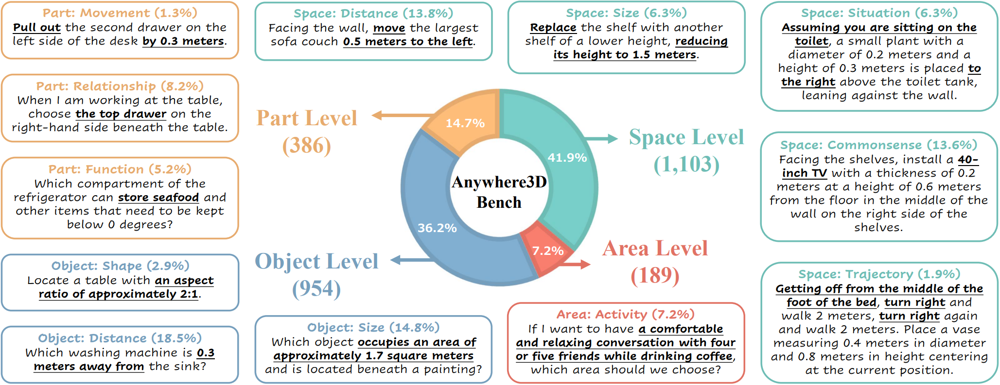

# From Objects to Anywhere: A Holistic Benchmark for Multi-level Visual Grounding in 3D Scenes
[Tianxu Wang](https://github.com/TXWang98)<sup>1</sup>, [Zhuofan Zhang](https://github.com/zfzhang-thu)<sup>1,2</sup>, [Ziyu Zhu](https://github.com/zhuziyu-edward)<sup>1,2</sup>, [Yue Fan](https://github.com/YueFan1014)<sup>1</sup>, [Jing Xiong](https://github.com/Aurora-Xiong/)<sup>1,3</sup>, [Pengxiang Li](https://github.com/Pengxiang-Li)<sup>1,4</sup>, [Xiaojian Ma](https://jeasinema.github.io/)<sup>1</sup>, [Qing Li](https://liqing.io/)<sup>1, *</sup>

*: corresponding author

<sup>1</sup> BIGAI, <sup>2</sup>Tsinghua University, <sup>3</sup>Peking University, <sup>4</sup>Beijing Institute of Technology


<p align="center">
  <a href="https://arxiv.org/abs/2506.04897">
    
  </a>
  <a href="https://github.com/anywhere-3d/Anywhere3D">
    
  </a>
  <a href="https://huggingface.co/datasets/txwang98/Anywhere3D">
    
  </a>
  <a href="https://anywhere3d-viewer-webpage.onrender.com/apps/meshviewer/datasetname=arkitscene_valid&scene_id=scene0004_00">
    
  </a>
</p>


<p align="center">
  
</p>

<p align="center">
  <b>Figure 1:</b> Multi-level visual grounding in 3D scenes.
</p>

<p align="center">
  
</p>

<p align="center">
  <b>Figure 2:</b> Distinct expression types on Anywhere3D-bench
</p>


## 📰 News

- 🧑‍💻 **2025/05/26** Release Human Annotation Interface Demo, supporting four scenes from ScanNet, MultiScan, 3RScan, ARKitScenes. Click [Here](https://anywhere3d-viewer-webpage.onrender.com/apps/meshviewer/datasetname=arkitscene_valid&scene_id=scene0004_00) to play around and further tutorial.
- 📄 **2025/06/04** Paper submitted to arXiv: [Anywhere3D Paper](https://arxiv.org/abs/2506.04897)
- 📺 **2025/06/13** Release Video Demo: [Anywhere3D Video Demo](https://www.youtube.com/watch?v=rZiqZz_ME7g)
- 🤖 **2025/07/07** Add more evaluation results on Anywhere3D-Bench, including the state-of-the-art visual thinking models Google Gemini-2.5-pro and openAI o3: check the updated results on our project page [Anywhere3D Project Page](https://anywhere-3d.github.io/)


## 🧠 Abstract
<details>
<summary><strong>TL;DR We introduce Anywhere3D-Bench, a holistic 3D visual grounding benchmark consisting of 2.6K referring expression-3D bounding box pairs spanning four different grounding levels: human-activity areas, unoccupied space beyond objects, objects in the scene, and fine-grained object parts.</strong></summary>

3D visual grounding has made notable progress in localizing objects within complex 3D scenes. However, grounding referring expressions beyond objects in 3D scenes remains unexplored. In this paper, we introduce Anywhere3D-Bench, a holistic 3D visual grounding benchmark consisting of 2,632 referring expression-3D bounding box pairs spanning four different grounding levels: human-activity areas, unoccupied space beyond objects, objects in the scene, and fine-grained object parts. We assess a range of state-of-the-art 3D visual grounding methods alongside large language models (LLMs) and multimodal LLMs (MLLMs) on Anywhere3D-Bench. Experimental results reveal that space-level and part-level visual grounding pose the greatest challenges: space-level tasks require a more comprehensive spatial reasoning ability, for example, modeling distances and spatial relations within 3D space, while part-level tasks demand fine-grained perception of object composition. Even the best performance model, OpenAI o4-mini, achieves only 23.57% accuracy on space-level tasks and 33.94% on part-level tasks, significantly lower than its performance on area-level and object-level tasks. These findings underscore a critical gap in current models' capacity to understand and reason about 3D scene beyond object-level semantics.

</details>

## 📦 Anywhere3D-Bench

We release our dataset on huggingface.

- 🔗 [Anywhere3D-Bench](https://huggingface.co/datasets/txwang98/Anywhere3D)


## 🛠️ Implementation

To reproduce the evaluation results on Anywhere3D-Bench

```bash
git clone https://github.com/anywhere-3d/Anywhere3D.git
cd Anywhere3D
pip install -r requirements.txt
```

Generate LLM's prediction on Anywhere3D(Please add your own API-KEY for corresponding models: GPT-4.1, o4-mini, Qwen, DeepSeek...)
```bash
cd LLM
python generate_predictions.py
```

Evaluate LLM's prediction on Anywhere3D(Please extract the center coordinates and sizes of the predicted bounding box first, then evaluate)
```bash
cd LLM
python process_bbx_with_regular_expression.py
python process_bbx_with_LLM.py
python evaluate_predictions.py
```

Generate VLM's prediction on Anywhere3D(Please follow GPT4Scene to generate Bird's Eye View and Video Frames of each scene first and save them in corresponding folder, i.e. ./3RScan_gpt4scene_data, ./arkitscene_gpt4scene_data, ./multiscan_gpt4scene_data, ./scannet_gpt4scene_data.  Add your own API-KEY for corresponding models: GPT-4.1, o4-mini, Qwen, InternVL3.)
```bash
cd VLM
python generate_predictions.py
```

Evaluate VLM's prediction on Anywhere3D(Please extract the center coordinates and sizes of the predicted bounding box first, then evaluate)
```bash
cd VLM
python process_bbx_with_regular_expression.py
python process_bbx_with_LLM.py
python evaluate_predictions.py
```


## ✅ To Do

- [ ] Release Code: Human Annotation Tool
- [ ] Release Code: Caption Generation with [Qwen2.5-VL](https://arxiv.org/abs/2502.13923), Object Orientation Generation with [Orient Anything](https://orient-anything.github.io/)

---

## 🙏 Acknowledgements

We would like to especially thank [ScanRefer](https://github.com/daveredrum/ScanRefer) for providing an excellent 3D annotation interface, which greatly facilitated the annotation process. We also appreciate the modifications made by [SQA3D](https://github.com/SilongYong/SQA3D) to the ScanRefer annotation interface. The annotation interface used in Anywhere3D was adapted from their well-designed interfaces. We are deeply grateful for their wonderful design and generous sharing with the community.

We would also like to thank the open source of the following projects: 

- **3D Datasets:** [ScanNet](https://github.com/ScanNet/ScanNet), [MultiScan](https://github.com/smartscenes/multiscan), [3RScan](https://github.com/WaldJohannaU/3RScan), [ARKitScenes](https://github.com/apple/ARKitScenes); 
- **3D Visual Grounding Models:** [3D-VisTA](https://github.com/3d-vista/3D-VisTA), [PQ3D](https://github.com/PQ3D/PQ3D), [Chat-Scene](https://github.com/ZzZZCHS/Chat-Scene); 
- **MLLMs:** [GPT4Scene](https://github.com/Qi-Zhangyang/GPT4Scene-and-VLN-R1), [LLaVA-OneVision](https://huggingface.co/lmms-lab/llava-onevision-qwen2-7b-ov), [Qwen2.5-VL](https://github.com/QwenLM/Qwen2.5-VL); 
- **LLMs:** [DeepSeek-R1](https://github.com/deepseek-ai/DeepSeek-R1), [Qwen3](https://github.com/QwenLM/Qwen3), [Qwen2.5](https://arxiv.org/pdf/2412.15115).

We also wish to thank the numerous inspiring works on 3D visual grounding and spatial intelligence that have informed and motivated our research, though it is difficult to list all of them here.

## 📖 Citation

If you find this project helpful, please consider citing:

```bibtex
@misc{anywhere3d,
      title={From Objects to Anywhere: A Holistic Benchmark for Multi-level Visual Grounding in 3D Scenes}, 
      author={Tianxu Wang and Zhuofan Zhang and Ziyu Zhu and Yue Fan and Jing Xiong and Pengxiang Li and Xiaojian Ma and Qing Li},
      year={2025},
      eprint={2506.04897},
      archivePrefix={arXiv},
      primaryClass={cs.CV},
      url={https://arxiv.org/abs/2506.04897}, 
}
```

## 🙏 Acknowledgements

We thank the contributors of [ScanNet](http://www.scan-net.org/), [ARKitScenes](https://github.com/apple/ARKitScenes), [3RScan](https://github.com/WaldJohannaU/3RScan), and [MultiScan](https://3dlg-hcvc.github.io/multiscan/#/) for providing the foundational data used in this benchmark.

